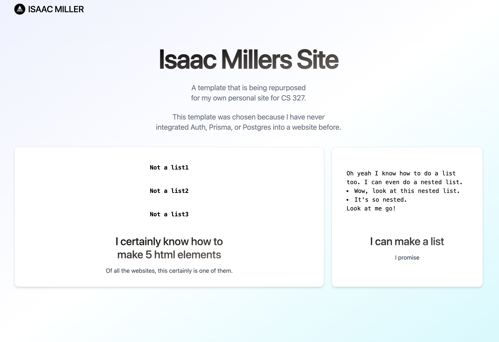

<a href="https://hello-web-cs-327.vercel.app/">
  <h1 align="center">Click here to go to the hosted version</h1>
</a>

<a href="https://github.com/isaacbmiller/hello-web-cs-327">
  <h1 align="center">Click here to go to the Github repo</h1>
</a>

 

## Introduction

This is my personal website based off of the Vercel Precedent template. I'm using it to learn Next.js, Prisma, and PostGres.

This was created as a part of the NU CS 327 Class.

You can find the hosted version [here](https://hello-web-cs-327.vercel.app/).

## Author

- Isaac Miller ([@isaacbmiller](https://github.com/isaacbmiller))

## Original Author and Template

Template Link: [Precedent](https://vercel.com/templates/next.js/precedent)

- Steven Tey ([@steventey](https://twitter.com/steventey))
